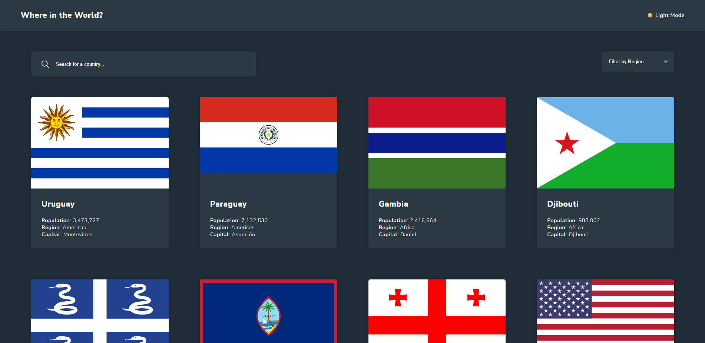
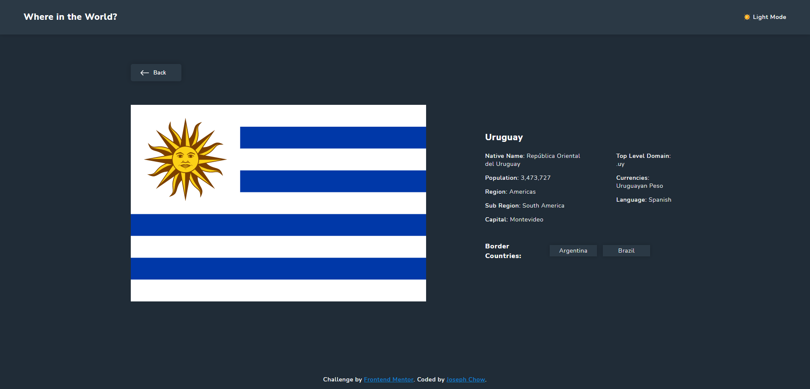

# Frontend Mentor - REST Countries API with color theme switcher solution

This is a solution to the [REST Countries API with color theme switcher challenge on Frontend Mentor](https://www.frontendmentor.io/challenges/rest-countries-api-with-color-theme-switcher-5cacc469fec04111f7b848ca). Frontend Mentor challenges help you improve your coding skills by building realistic projects.

## Table of contents

- [Overview](#overview)
  - [The challenge](#the-challenge)
  - [Screenshot](#screenshot)
  - [Links](#links)
- [My process](#my-process)
  - [Built with](#built-with)
  - [What I learned](#what-i-learned)
  - [Continued development](#continued-development)
- [Author](#author)
- [Acknowledgments](#acknowledgments)

## Overview

### The challenge

Users should be able to:

- See all countries from the API on the homepage
- Search for a country using an `input` field
- Filter countries by region
- Click on a country to see more detailed information on a separate page
- Click through to the border countries on the detail page
- Toggle the color scheme between light and dark mode

### Screenshot





### Links

- Solution URL: [Add solution URL here](https://your-solution-url.com)
- Live Site URL: [https://where-in-the-world-by-chowjiaming.netlify.app](https://where-in-the-world-by-chowjiaming.netlify.app)

## My process

### Built with

- Semantic HTML5 markup
- CSS custom properties
- Flexbox
- CSS Grid
- Mobile-first workflow
- [React](https://reactjs.org/) - JS library
- [React Router](https://reactrouter.com/) - React Package

### What I learned

This was the first time I used the useRef hook in a project. In the Filter component, when the user selects a filter option I pass false to setDropdownOpen, but the filter would not recognize an outside click to close the dropdown. I researched and created a custom hook that compared the current ref to the target the user is currently clicking. It sets setDropdownOpen to false when it registered that the current user target is outside of the Filter component ref. 

```js
const useHandleClickOutside = (ref) => {
  useEffect(() => {
    const handleClickOutside = (e) => {
      if (ref.current && !ref.current.contains(e.target))
        setDropdownOpen(false);
    };
    document.addEventListener("mousedown", handleClickOutside);
    return () => {
      document.removeEventListener("mousedown", handleClickOutside);
    };
  }, [ref]);
};
```

### Continued development

[https://restcountries.com/](https://restcountries.com/) provides additional details about each country. It would be nice to have differentiated detail pages where a user could click on detail topics inside and view more specific details about each country. The challenge did not include pagination for the main search page, adding pagination would greatly benefit the usability of the home page. I have added pagination as a separate branch in this project.

## Author

- Website - [https://josephchow.dev/](https://josephchow.dev/)
- Frontend Mentor - [@chowjiaming](https://www.frontendmentor.io/profile/chowjiaming)
- Twitter - [@Couri3r](https://twitter.com/Couri3r)

## Acknowledgments

A tip of the hat to [https://usehooks.com](https://usehooks.com/useLocalStorage/) for providing a fantastic template solution for using localstorage to keep the user's theme preference saved.
